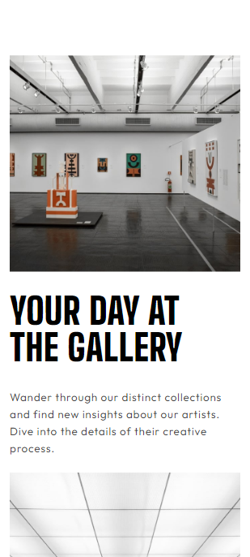
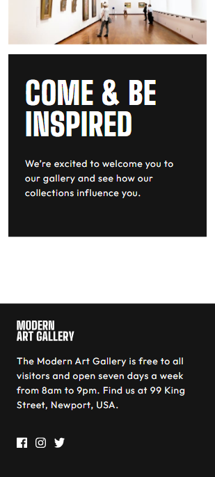
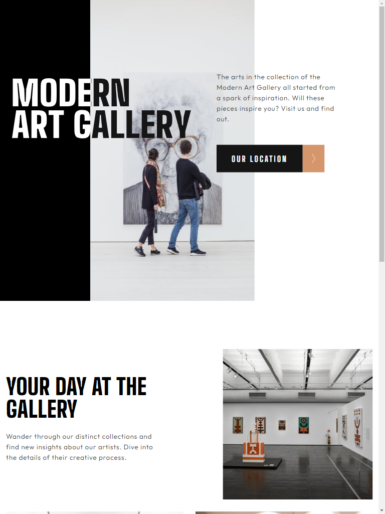
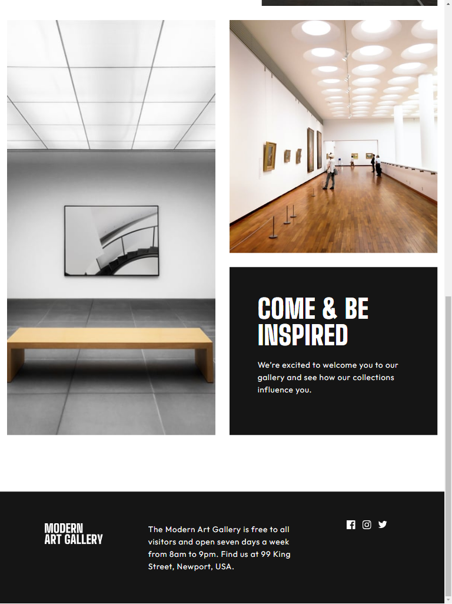
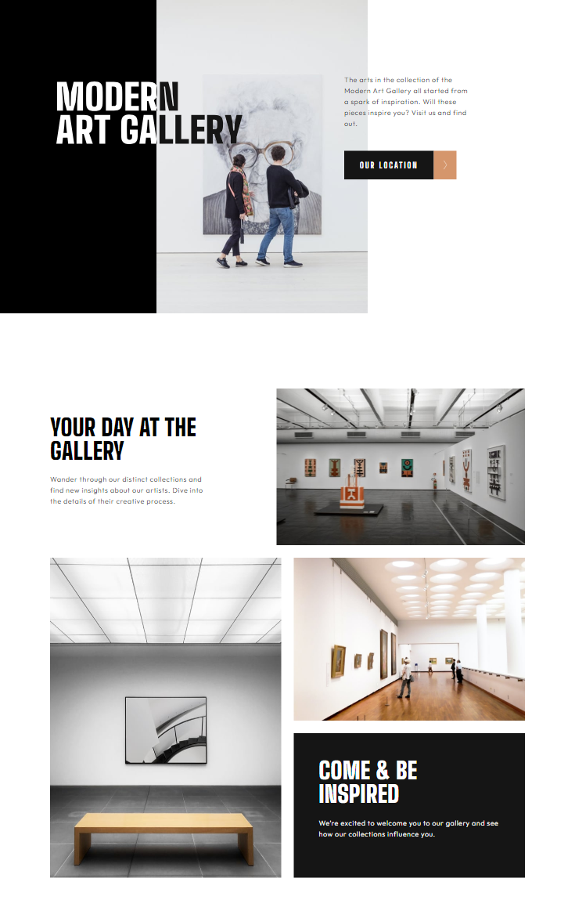
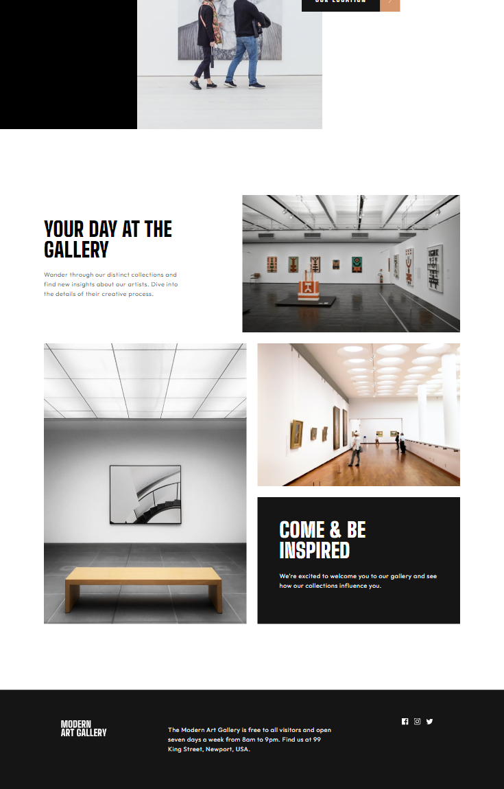

# Art gallery

## Table of contents

## Overview

- [Overview](#overview)
  - [The challenge](#the-challenge)
  - [Screenshot](#screenshot)
  - [Links](#links)
- [My process](#my-process)
  - [Built with](#built-with)
  - [What I learned](#what-i-learned)
  - [Continued development](#continued-development)

### The challenge

- View the optimal layout for each page depending on their device's screen size
- See hover states for all interactive elements throughout the site

### Screenshot

- Mobile

- Tablet

- Desktop

### Links

- Live Site URL: [https://art-gallery-gi34i9bdm-mariahcasciolas-projects.vercel.app/](https://art-gallery-gi34i9bdm-mariahcasciolas-projects.vercel.app/)

## My process

- Used React to break up the page into a digestible format for future developement and for more modular development.

- Styled mobile view, tablet view, and desktop view in that order, checking that the previous view was not broken by the next created view.

- Identified flex box and flex directions in mobile before tackling flex box before designing tablet and desktop boxes and directions.

- Created reusable well named classes in order to create a more clean and dry stylesheet.

- When styling each viewpoint I started at the top of the page and worked my way down the document, checking responsiveness with every new class and property.

### Built with

- HTML5 markup
- CSS custom properties
- Google Font API
- Flexbox
- Mobile-first workflow
- [React](https://reactjs.org/) - JS library

### What I learned

- SVGs as an alternative to JPEGS, gifs and PNGs(that they are used with vectors instead of pixel grids) and scale up and down with resolution without losing quality.

- How to incorporate mulitple images at different viewpoints while learning how to hide them and remove them from flex box layouts

- How to use @font-face property in CSS for .ttf files

- About the clip-path property and z-index property

### Continued development

- A shopping cart for Art Gallery tickets
